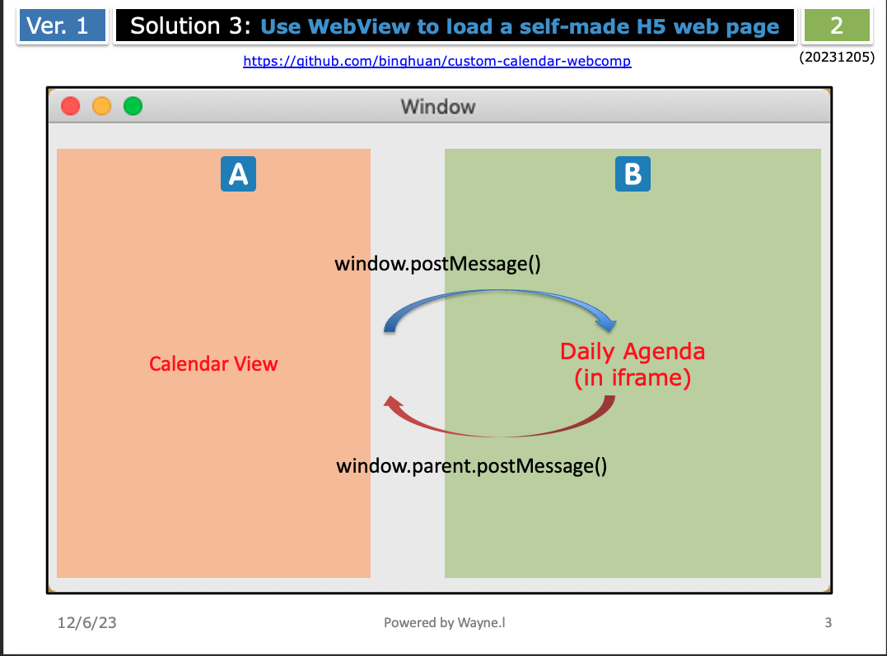
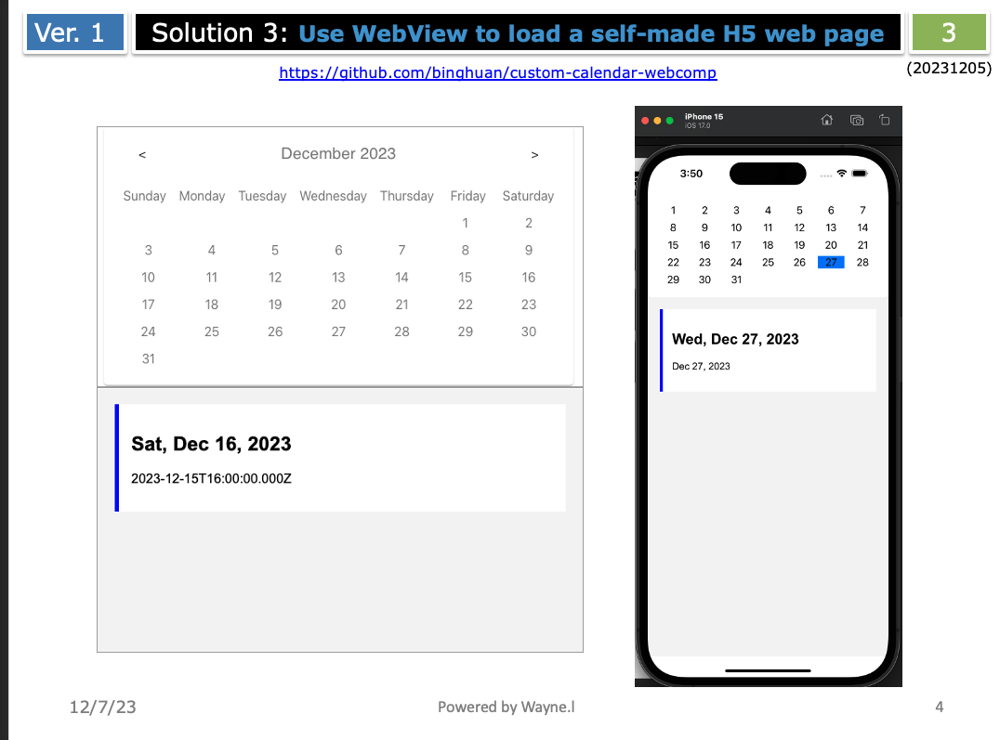

custom-calendar-webcomp
=======================

This project is a demo of a custom calendar widget for iOS/Android/Mac/Linux. It is implemented using the WebView component, which loads a self-made H5 web page.

- [custom-calendar-webcomp](#custom-calendar-webcomp)
  - [Introduction](#introduction)
    - [Solution 1: Write Your Own Calendar Widget](#solution-1-write-your-own-calendar-widget)
    - [Solution 2: Use a Third-Party Calendar Widget](#solution-2-use-a-third-party-calendar-widget)
    - [Solution 3: Use WebView to Load a Self-Made H5 Web Page](#solution-3-use-webview-to-load-a-self-made-h5-web-page)
  - [Demo](#demo)

## Introduction
If you want to implement a calendar widget in your application, you have the following solutions:

### Solution 1: Write Your Own Calendar Widget
  - **Pros:**
    - **Complete Creative Freedom:** Full control over the design and functionality, enabling the creation of unique and tailored user experiences.
    - **Tailored Functionality:** Ability to implement specific features and integrations that perfectly align with project requirements.
  - **Cons:**
    - **Time and Resource Intensive:** Developing a widget from the ground up requires significant investment in terms of time, effort, and potentially, development resources.
    - **Maintenance and Updates:** Responsibility for ongoing maintenance, bug fixes, and updates, which can be demanding over time.

### Solution 2: Use a Third-Party Calendar Widget
  - **Pros:**
    - Speedy implementation with pre-built functionalities.
  - **Cons:**
    - Limited support for uniform codebase across different platforms, potentially leading to inconsistent user experiences.
    - Restricted customization options; reliance on third-party code for modifications.

### Solution 3: Use WebView to Load a Self-Made H5 Web Page
  - **Pros:**
    - Uniform H5 codebase for all platforms, ensuring a consistent experience.
    - Facilitates a cross-platform solution.
  - **Cons:**
    - Requires manual implementation of interactions between H5 web content and native code.
    - Potential initial slow loading due to web caching.

## Demo
